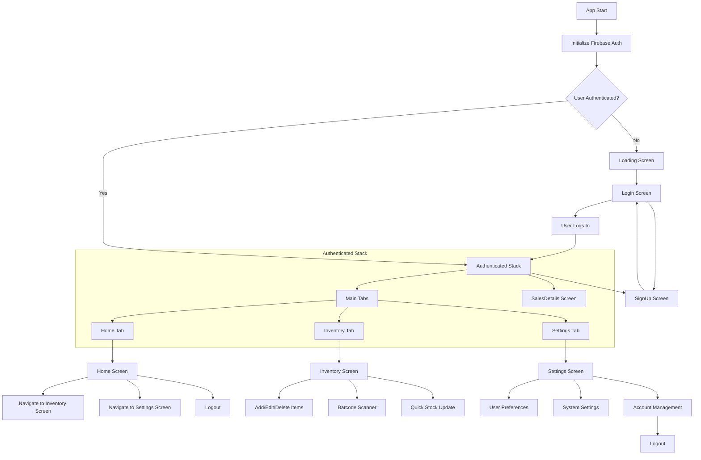
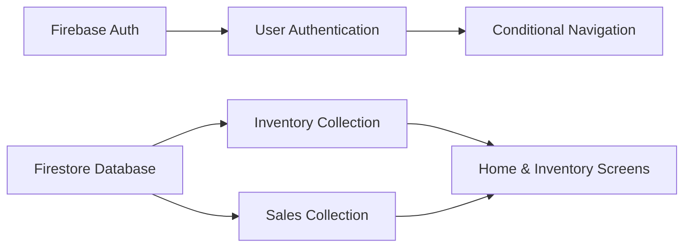

# Full App Flowchart

## Overall Navigation Flow

## Screen Details

### Login Screen
- User inputs email and password
- On success, navigates to authenticated stack
- Link to SignUp screen

### SignUp Screen
- User inputs email, username, password, confirm password
- On success, navigates to Login screen

### Home Screen
- Displays welcome message with username
- Shows quick stats: total items, total value, out of stock, total revenue
- Quick actions: navigate to Inventory screen
- Buttons for Settings and Help modal
- Logout button signs out user

### Inventory Screen
- Displays list of inventory items with search and category filter
- Add new item form with barcode scanner support
- Edit and delete items
- Quick stock update mode with barcode scanning
- Real-time updates from Firestore stock movements and sales collections

### Settings Screen
- User preferences: email notifications, low stock alerts, currency
- System settings: low stock threshold, refresh interval
- Account management: view profile, logout

### SalesDetails Screen
- Displays sales data for the authenticated user
- Shows product code, quantity sold, date, and price

## Data Flow

## Component Hierarchy

- App.js (Main entry point)
  - NavigationContainer
    - Stack.Navigator
      - LoginScreen
      - SignUpScreen
      - MainTabs (Bottom Tab Navigator)
        - HomeScreen
        - InventoryScreen
        - SettingsScreen
      - SalesDetailsScreen
